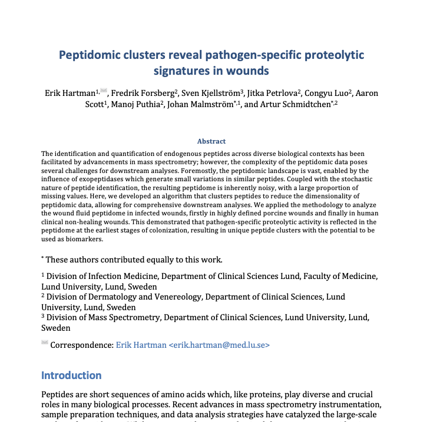
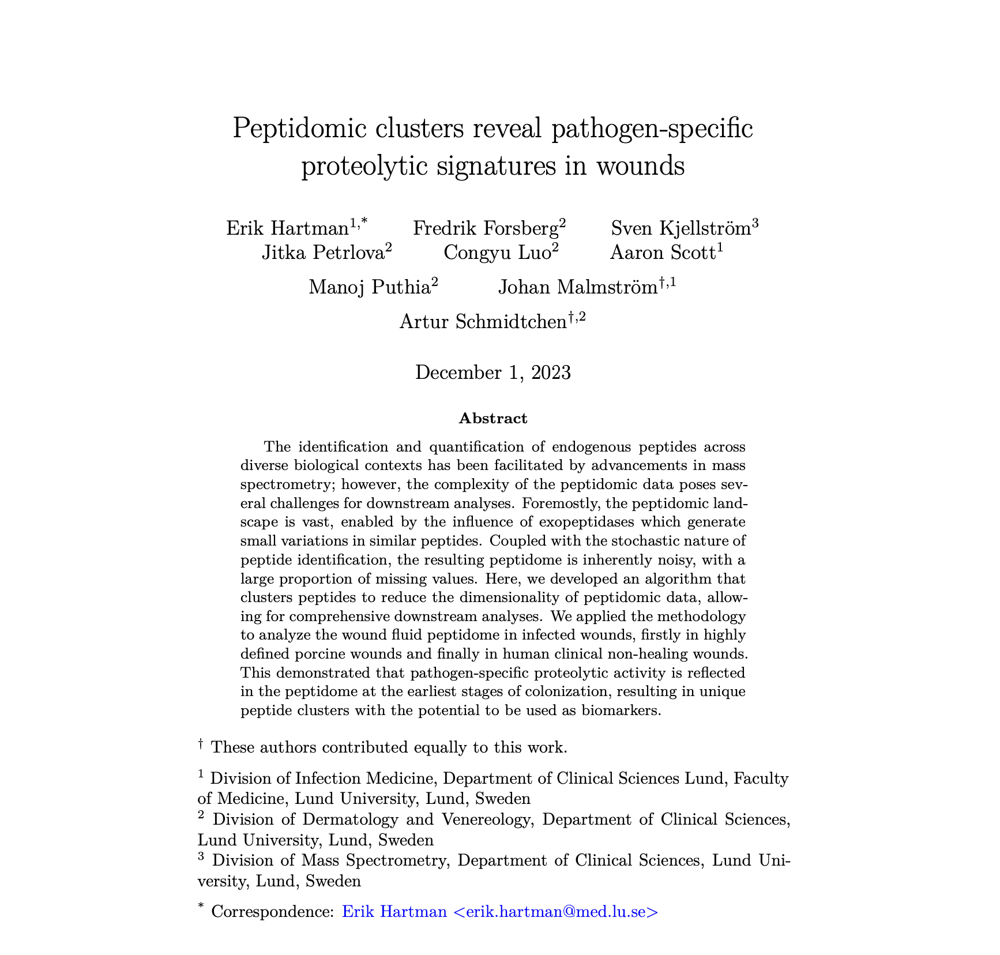

# Writing academic articles in Markdown


**TLDR:** I write my papers in Markdown using:
- [Markdown Preview Enhanced in VS Code](https://shd101wyy.github.io/markdown-preview-enhanced/#/)
- [Pandoc](https://pandoc.org/) to export to any format (Word/PDF in my cases).
- [lua-filters](https://github.com/pandoc/lua-filters) and .tex-templates to stylize the documents 

It's really nice. Here are some more extensive articles / videos about writing academic papers in markdown:

- [This article by Jaan Tollander is really good.](https://jaantollander.com/post/scientific-writing-with-markdown/)
- [Extensive video](https://www.youtube.com/watch?v=J86Pm62XM_Q)
- [Shorter article](https://brainbaking.com/post/2021/02/writing-academic-papers-in-markdown/)

---


I've been on the search for a lightweight and reliable way to write academic articles, but it's more difficult than you'd think. Today, the gold standards are LaTeX (for math, physics and engineering) and Word for basically everything else. While both of these tools are good, they're lacking in several aspects.

Word has too much functionality. For scientific articles, all you really need is the abilities to:
1. create headers
2. insert figures
3. insert tables
4. write mathematical expressions/chemical formulae etc.
5. reference and cite

Beyond this, Word offers a bunch of things which really is just bloat, like different fonts, shapes, colors, etc. It also is severely lacking in points 4 and 5. Also, it uses the .docx-format, which is impossible to read without using Word.

LaTeX is way better in points 4 and 5, as writing mathematical expressions and referencing using .bib is extremely easy. It also cuts down on the bloat. However, it has a bit of a learning curve, is a pain to set up and has several quirks that you have to get used to. You can skip the setup by using Overleaf, but then you restrict your writing to having internet access, and you're relying on Overleaf servers.

In the end, I've settled on writing in pure **Markdown** and use a set of tools to get everything you need to write scientific articles. I keep my paper-files in a subdirectory in the .git-repo for my project, so that everything is kept in .git and is in the same place. I then use Markdown Preview Enchanced and Pandoc to generate the desired formats.

## What is Markdown
Markdown is a lightweight markup language that uses plain text formatting syntax to create structured documents. Here are some basic examples of Markdown syntax:

```
Headers:
# Heading 1
## Heading 2
### Heading 3

Emphasis:
*italic* or _italic_
**bold** or __bold__

Lists:
- Item 1
- Item 2
  - Subitem 2.1
  - Subitem 2.2
1. Numbered item 1
2. Numbered item 2

Links:
[Link text](http://example.com)

Images:


Code:
`inline code`
```

## Markdown Preview Enhanced 
**This requires Visual Studio Code*

[Markdown Preview Enhanced](https://shd101wyy.github.io/markdown-preview-enhanced/#/) is an extension available in Visual Studio Code that allows you to preview your Markdown-files while writing them. It also supports Mathematical expressions in a LaTeX-style. Writing in your code editor allows you to easily check your code for results and then quickly add them to your paper. In general, this creates the best writing experience I've had. 


## Converting to .html, .tex, .pdf, .docx using Pandoc

The magic sets in when you combine Markdown Preview Enhanced with [Pandoc](https://pandoc.org/). Pandoc is a versatile document converter and markup language processor that allows for the conversion between different document formats, and it integrates with Markdown Preview Enhanced.

By specifying arguments in the header of your document, you can export your .md file to many other formats. I've used it for creating .docx and .pdf-files, and in both cases it has created well-stylized files.


<div style="display: flex;">
    <div style="flex: 33.33%;">
        
    </div>
    <div style="flex: 33.33%;">
        
    </div>
</div>


### The YAML-header
To convert the file, you need to declare some properties the header of your markdown file. The header sits at the top of the file, and may look like this:

```
---
title: My title
institute:
  - lu: Lund University
author: 
    - Erik Hartman
        institute: lu
output:
  word_document:
    path: /paper/main.docx
    pandoc_args: ["..."] # some pandoc args
citeproc: true
export_on_save:
  pandoc: true
bibliography: bibliography.bib
csl: vancouver.csl
---
```

I use lua-filters to create the author-list. To add these, copy the `author-info-blocks.lua` and `scholarly-metadata.lua` from [here](https://github.com/pandoc/lua-filters) and then insert the following to your pandoc_args:
```
pandoc_args: ["--lua-filter=scholarly-metadata.lua","--lua-filter=author-info-blocks.lua"]
```

More information about using Pandoc with Markdown Preview enhanced can be found [here](https://shd101wyy.github.io/markdown-preview-enhanced/#/).


There are a bunch more extensions and plug-ins that you can add if you wish, but what I outline above is really all you need for most purposes.


